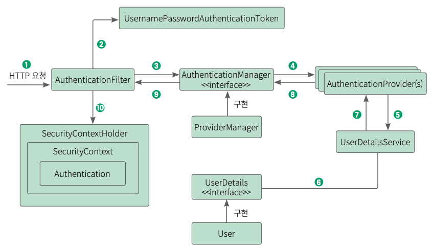
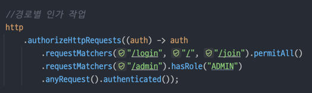
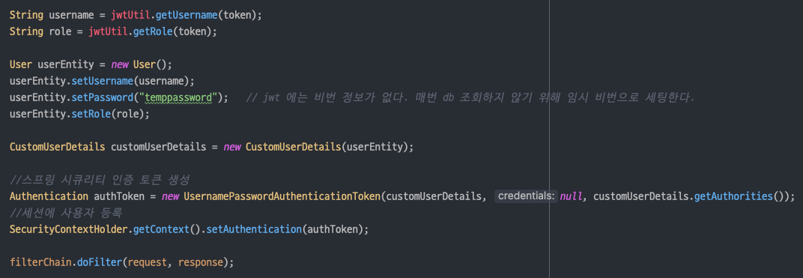
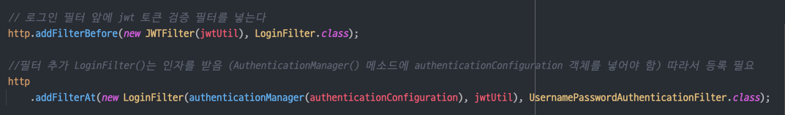

## 1. SecurityConfig 기본 요소 작성

- postman 을 이용해 로그인 테스트를 진행
    - form login 방식을 disable 시킨다.
    - 헤더 방식 인증(httpBasic) disable
    - 경로별 인가 작업
    - jwt 인증을 위한 세션 stateless 설정

## 2. 회원가입

- username, password 정보를 담고있는 User entity 생성
- JoinController 를 통해 DB 에 회원정보 저장

## 3. 로그인 필터로 로그인 정보 추출

- 스프링 시큐리티 필터 사용
- 폼 로그인 기능이 켜져있었다면 스프링 시큐리티가 내부적으로 UsernamePasswordAuthenticationFilter 를 이용해 username 과 password 를 검증했겠지만, 폼 로그인 기능을 꺼둔
  상태이므로 이 부분을 직접 구현해야 한다.
- UsernamePasswordAuthenticationFilter 를
  상속받은 [LoginFilter](https://github.com/zhtmr/springJwt-ex/blob/677c25ae9b9ee6fbb6a6e83431799fcd80afff79/src/main/java/com/ex/springjwtex/jwt/LoginFilter.java)
  구현
- 스프링 시큐리티는 request 정보에서 username 과 password 라는 키값으로 정보를 가져온 뒤 유효성 검증을 진행한다.
  

  
- 위 사진은 스프링 시큐리티 내부에서 form login 방식을 이용했을 때 실행되는 메소드다. 유효성 검증이 끝난 username 과 password 를
  UsernamePasswordAuthenticationToken 에 담아 authenticationManager 로 보내는 것을 알 수 있다. 우리가 구현해야 할 부분이 이 부분이다.
- 스프링 시큐리티의 구현 방식을 따라 username 과 password 를 UsernamePasswordAuthenticationToken 에 담아 전달해준다.
  ```java
  @Override
  public Authentication attemptAuthentication(HttpServletRequest request,
      HttpServletResponse response) throws AuthenticationException {

    //클라이언트 요청에서 username, password 추출
    String username = obtainUsername(request);
    String password = obtainPassword(request);

    System.out.println("username = " + username);

    //스프링 시큐리티에서 username과 password를 검증하기 위해서는 token에 담아야 함
    UsernamePasswordAuthenticationToken authToken =
        new UsernamePasswordAuthenticationToken(username, password, null);

    //token에 담은 검증을 위한 AuthenticationManager로 전달
    return authenticationManager.authenticate(authToken);
  }
  ```
- 이 LoginFilter 를 스프링 시큐리티에 등록해 준다. 스프링 시큐리티는 UsernamePasswordAuthenticationFilter 가 호출한 AuthenticationManager 를 통해 회원 검증을 진행한다.
  ```java
  // SecurityConfig
  // 필터 추가 LoginFilter()는 인자를 받음 (AuthenticationManager() 메소드에 authenticationConfiguration 객체를 넣어야 함) 따라서 등록 필요
  http
    .addFilterAt(new LoginFilter(authenticationManager(authenticationConfiguration), jwtUtil), UsernamePasswordAuthenticationFilter.class);
  ```
- 여기까지 로그인 인증 작업이 완료되었다. 이제 이 유저 정보를 이용해 DB 데이터와 비교하고([4](#4-db-유저-정보-검증)), 일치하면 JWT 토큰을 발급해서 클라이언트에게 보내줘야
  한다.([5](#5-jwt-발급-클래스-작성), [6](#6-로그인-성공-시-jwt-발급)) 그 후 클라이언트가 이 토큰을 이용해 접근할 수 있도록 또 다른 필터(JWTFilter)를 등록하는 작업을 진행해야 한다.([7](#7-jwtfilter-등록))

## 4. DB 유저 정보 검증


*출처: https://goldenrabbit.co.kr/2024/04/05/spring-%EC%8A%A4%ED%94%84%EB%A7%81-%EC%8B%9C%ED%81%90%EB%A6%AC%ED%8B%B0%EB%9E%80/*

스프링 시큐리티는 사용자 정보를 가져오는데 UserDetailService 를 사용한다.   
이 클래스를 상속 받은 뒤 loadUserByUsername() 을 오버라이드하면 스프링 시큐리티에서 오버라이드된 메서드를
사용하게 된다. 3번 로그인필터 과정을 거친 후 username 이 파라미터로 들어온다.

```java
@Service
public class CustomUserDetailsService implements UserDetailsService {
  private final UserRepository userRepository;

  public CustomUserDetailsService(UserRepository userRepository) {
    this.userRepository = userRepository;
  }

  @Override
  public UserDetails loadUserByUsername(String username) throws UsernameNotFoundException {
    User user = userRepository.findByUsername(username);
    if (user != null) {
      //UserDetails에 담아서 return하면 AuthenticationManager 검증 함
      return new CustomUserDetails(user);
    }
    return null;
  }
}
```

UserDetailsService 는 사용자 정보를 UserDetail 객체에 담아서 AuthenticationManager 에 전달하도록 구성해야 한다. 이를 위해 UserDetails 를 오버라이드
한 [CustomUserDetails](https://github.com/zhtmr/springJwt-ex/blob/c84845a1161854ead757761ff31ee5d58460f49d/src/main/java/com/ex/springjwtex/dto/CustomUserDetails.java)
를 만든다.

UserDetails 를 구현하면 각종 유저 정보에 대한 메서드를 오버라이딩 해야한다. 즉, 이 UserDetails 을 구현한 클래스에서 DB 에서 조회한 유저 정보를 갖고 있게 된다. 스프링 시큐리티 흐름 내에서
인증된 유저의 정보를 꺼내고 싶으면 이 UserDetails 객체에서 정보를 꺼내면 된다.

## 5. JWT 발급 클래스 작성

### jwt 구조

먼저 jwt 의 구조와 개념에 대해서 알아보자.
jwt 는 header / payload / signature 구조로 이루어져 있다.


- Header
    - jwt 임을 명시
    - 사용된 암호화 알고리즘
- Payload
    - 정보
- Signature
    - Base64(header) + Base64(payload) + secret key

jwt 는 입장권이라고 생각하면 된다.
간단한 정보와 서명이 적혀 있고 이를 서버에 제시하면 서버에서 검증 후 통과 여부를 판단한다.
payload 에는 username 이나 role 처럼 외부에서 열람해도 상관없는 정보를 담아야 하며, 비밀번호 같은 정보는 절대 담아선 안된다. 애초에 그런 정보를 담을 필요가 없다.
서버에서 jwt 를 생성했을 때의 값과 클라이언트에서 보내오는 jwt 정보가 같은지에 대해서만 비교하기 때문이다.

만약 발급된 토큰을 탈취당해 payload 값이 바뀐다면 signature 값도 바뀌므로 서버 인증 실패할 것이다. 그러나 secret key 값이 너무 짧거나 유추하기 쉽다면 brute force 에 의해 뚫릴 수
있다. 이를 방지하기 위해선 서버에서 정의한 secret key 값이 충분히 길고 복잡해야 한다.

### jwt 발급 클래스

#### secret key 설정

jwt 발급을 담당할 클래스를 작성하기 전에 secret key 를 애플리케이션 내부에서 관리하고 있어야 한다.

```properties
# application.properties
spring.jwt.secret=vmfhaltmskdlstkfkdgodyroqkfwkdbalroqkfwkdbalaaaaaagregaaaaaaaabbbbb
```

#### jwt 의존성 추가

jwt 의존성을 추가한다.

```groovy
// build.gradle
implementation 'io.jsonwebtoken:jjwt-api:0.12.3'
implementation 'io.jsonwebtoken:jjwt-impl:0.12.3'
implementation 'io.jsonwebtoken:jjwt-jackson:0.12.3'
```

적당히 길고 복잡한 문자열을 application.properties 에 작성해 둔다.

[JWTUtil](https://github.com/zhtmr/springJwt-ex/blob/1fe7a4c86eb4a6e04cd9c6ab3cdfa1a3f8f80ca3/src/main/java/com/ex/springjwtex/jwt/JWTUtil.java)
클래스에서 application.properties 에 정의한 secret key 값을 가져와 객체 형태로 만든다.
이 secret key 값은 위 jwt 구조에서 봤듯이 signature 를 만드는데 사용된다.

#### jwt 토큰 검증 및 생성 메소드

요청시 보내온 jwt 값에서 username 과 role 값을 추출하기 위한 메소드를 생성한다.

```java
public String getUsername(String token) {
  return Jwts.parser().verifyWith(secretKey).build().parseSignedClaims(token).getPayload().get("username", String.class);
}

public String getRole(String token) {
  return Jwts.parser().verifyWith(secretKey).build().parseSignedClaims(token).getPayload().get("role", String.class);
}
```

token 파라미터 값으로 jwt 가 전달될 것이다. secret key 로 signature 검증 후 payload 값을 추출한다.

그리고 jwt 토큰은 보안을 위해 만료시간 설정이 필요한데, 토큰이 만료되었는지 아닌지를 확인할 메서드도 만든다.

```java
public Boolean isExpired(String token) {
  return Jwts.parser().verifyWith(secretKey).build().parseSignedClaims(token).getPayload().getExpiration().before(new Date());
}
```

jwt 토큰 생성을 위한 메소드

```java
public String createJwt(String username, String role, Long expiredMs) {
  return Jwts.builder()
          .claim("username", username)
          .claim("role", role)
          .issuedAt(new Date(System.currentTimeMillis()))
          .expiration(new Date(System.currentTimeMillis() + expiredMs))
          .signWith(secretKey)
          .compact();
}
```



지금까지 작업한 내용으로 서버를 구동시키고 postman 으로 회원가입과 로그인 요청을 보내면 정상적으로 작동한다.
그러나 `/admin` 과 같이 인가(Authorization)가 필요한 경로에 대해선 거부될 것이다.
SecurityConfig 에 해당 경로에 대해선 ADMIN 권한이 있는 사용자만 접근 가능하도록 설정했기 때문이다.

ADMIN 권한을 가진 사용자가 해당 api 를 사용하도록 하려면 요청 시 제시한 입장권(jwt)에서 권한정보를 가져와 확인하는 작업을 해야한다. 이 작업을 할 필터를 정의한다.

## 6. 로그인 성공 시 jwt 발급
아까 [LoginFilter](https://github.com/zhtmr/springJwt-ex/blob/677c25ae9b9ee6fbb6a6e83431799fcd80afff79/src/main/java/com/ex/springjwtex/jwt/LoginFilter.java) 에서 메소드 오버라이딩 시 successfulAuthentication 메소드와 unsuccessfulAuthentication 메소드를 작성하지 않았는데, 
로그인 성공 시 successfulAuthentication 메소드가 실행된다. 이 부분에서 jwt 를 생성해 클라이언트에게 전달해 주면된다.

```java
//로그인 성공시 실행하는 메소드 (여기서 JWT를 발급하면 됨)
@Override
protected void successfulAuthentication(HttpServletRequest request, HttpServletResponse response, FilterChain chain, Authentication authentication) {
  CustomUserDetails customUserDetails = (CustomUserDetails) authentication.getPrincipal();
  String username = customUserDetails.getUsername();

  Collection<? extends GrantedAuthority> authorities = authentication.getAuthorities();
  Iterator<? extends GrantedAuthority> iterator = authorities.iterator();
  GrantedAuthority auth = iterator.next();

  String role = auth.getAuthority();

  String token = jwtUtil.createJwt(username, role, 60 * 60 * 10L);
  response.addHeader("Authorization", "Bearer " + token);
}

//로그인 실패시 실행하는 메소드
@Override
protected void unsuccessfulAuthentication(HttpServletRequest request, HttpServletResponse response, AuthenticationException failed) {
  response.setStatus(401);
}
```
로그인 성공 후 jwt 를 발행하는 코드까지 완성했다. 클라이언트는 이제부터 api 요청 시 서버에서 만들어 준 jwt 를 헤더의 'Authorization' 에 담아서 보내게 될 것이다.
그러면 서버는 보낸 이 jwt 가 유효한지 검증할 필터를 추가해 우리가 본래 하고자 했던 *ADMIN 권한을 가진 유저가 `/admin` 경로로의 요청*이 정상적으로 작동되도록 한다.

## 7. JWTFilter 등록

유저가 보내온 요청에서 jwt 를 추출해 권한을 확인하기 위해 [JWTFilter](https://github.com/zhtmr/springJwt-ex/blob/824141fff47625936bf5822eb9987f433a69dadf/src/main/java/com/ex/springjwtex/jwt/JWTFilter.java)를 만든다.
먼저 헤더에 `Authorization` 값이 있는지 확인하고 그 안에 jwt 토큰이 있는지, 그리고 토큰이 만료되지 않았는지 확인한다.

토큰이 유효하다면 JWTUtil 에서 정의한 메소드를 이용해 payload 값을 추출한다.
그 후 [LoginFilter](https://github.com/zhtmr/springJwt-ex/blob/677c25ae9b9ee6fbb6a6e83431799fcd80afff79/src/main/java/com/ex/springjwtex/jwt/LoginFilter.java)
에서 진행했던 흐름 대로 똑같이 진행하면 된다.



유저 정보(username, role, password) 를 CustomUserDetails 에 담아 사용자 인증 정보를 생성한다.
UsernamePasswordAuthenticationToken 을 사용해 인증 토큰을 만들고, 이를 스프링 시큐리티의 SecurityContextHolder 에 저장하여 해당 세션에 사용자 인증을 설정한다.

JWTFilter 를 만들기 전에는 클라이언트에서 jwt 토큰을 보내도 서버에 이를 검증할 필터가 없어서 `/admin` 같은 경로가 제한되었는데, 이제 jwt 토큰을 통해 인증을 할 수 있는 필터가 완성되었다.

### SecurityConfig 에 등록 
jwt 필터가 동작하기 위해 SecurityConfig 에 등록해야 한다. 이 jwt 필터는 로그인 필터 전에 동작하는 것이 흐름상 적합하다. 
왜냐하면 클라이언트에서 헤더에 jwt 토큰을 담아서 요청이 들어오기 때문에 이 jwt 가 유효한지 우선 검증할 필요가 있다.  
주로 이미 로그인된 사용자가 이후 요청을 보낼 때 jwt 를 확인해 인증하기 위한 목적이다.



동작 흐름을 정리하자면 다음과 같다.

- JWTFilter
  1. 요청이 들어오면, JWTFilter 가 Authorization 헤더에서 JWT 토큰을 추출한다.
  2. 토큰이 유효하면 사용자 정보를 스프링 시큐리티의 컨텍스트에 설정하고, 다음 필터로 요청을 넘긴다.
  3. 토큰이 없거나 유효하지 않으면 그냥 다음 필터로 넘긴다 (로그인이 필요한 경우 LoginFilter 로 이동).
- LoginFilter
  1. 사용자가 로그인 요청을 보내면, LoginFilter 가 동작하여 username 과 password 를 추출한다.
  2. authenticationManager 를 통해 사용자 인증을 수행한다. 보통 데이터베이스에서 사용자 정보를 확인하고, 비밀번호 검증을 수행.
  3. 인증이 성공하면 JWTUtil 을 사용하여 새로운 JWT 토큰을 생성하고, 이를 응답에 포함시켜 클라이언트에 전달한다.
- 이후 요청부턴 클라이언트가 발급받은 JWT 토큰을 요청 헤더에 포함시켜 보낼 수 있으며, 이때는 JWTFilter 가 해당 토큰을 인증 처리한다. 따라서 로그인 후의 인증은 LoginFilter 대신 JWTFilter 가 담당하게 된다.
- JWTFilter 는 항상 LoginFilter 보다 먼저 동작하여, 이미 인증된 사용자는 다시 로그인할 필요 없이 토큰을 이용해 인증을 처리할 수 있다. LoginFilter 는 로그인 요청 시에만 동작한다.
