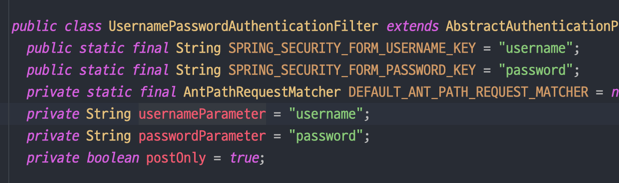
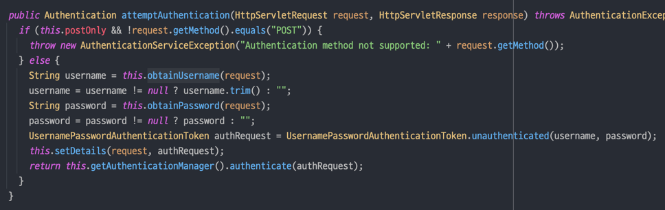
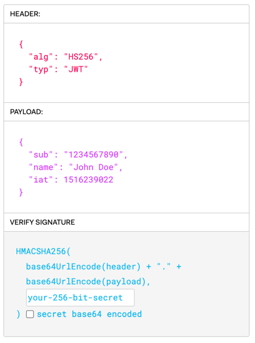

## 1. SecurityConfig 기본 요소 작성
- postman 을 이용해 로그인 테스트를 진행
  - form login 방식을 disable 시킨다.
  - 헤더 방식 인증(httpBasic) disable
  - 경로별 인가 작업
  - jwt 인증을 위한 세션 stateless 설정

## 2. 회원가입
- username, password 정보를 담고있는 User entity 생성
- JoinController 를 통해 DB 에 회원정보 저장

## 3. 로그인 필터
- 스프링 시큐리티 필터 사용
    - 폼 로그인 기능이 켜져있었다면 스프링 시큐리티가 내부적으로 UsernamePasswordAuthenticationFilter 를 이용해 username 과 password 를 검증했겠지만, 폼 로그인 기능을 꺼둔 상태이므로 이 부분을 직접 구현해야 한다.
    - UsernamePasswordAuthenticationFilter 를 상속받은 LoginFilter 구현
    - 스프링 시큐리티는 request 정보에서 username 과 password 라는 키값으로 정보를 가져온 뒤 유효성 검증을 진행한다.
          
    
      
    - 위 사진은 form login 방식을 이용했을 때 실행되는 메소드다. 유효성 검증이 끝난 username 과 password 를 UsernamePasswordAuthenticationToken 에 담아 authenticationManager 로 보내는 것을 알 수 있다. 우리가 구현해야 할 부분이 이 부분이다. 
    - 스프링 시큐리티의 구현 방식을 따라 username 과 password 를 UsernamePasswordAuthenticationToken 에 담아 전달해준다.
      ```java
      @Override
      public Authentication attemptAuthentication(HttpServletRequest request,
      HttpServletResponse response) throws AuthenticationException {
    
      //클라이언트 요청에서 username, password 추출
      String username = obtainUsername(request);
      String password = obtainPassword(request);
    
      System.out.println("username = " + username);
    
      //스프링 시큐리티에서 username과 password를 검증하기 위해서는 token에 담아야 함
      UsernamePasswordAuthenticationToken authToken =
      new UsernamePasswordAuthenticationToken(username, password, null);
    
      //token 에 담아 AuthenticationManager로 전달
      return authenticationManager.authenticate(authToken);
    
      }
      ```
    - 이 LoginFilter 를 스프링 시큐리티에 등록해 준다. 구성에 필요한 의존성 들은 생성자 주입 방식으로 SecurityConfig 에 주입해준다.
      ```java
      //필터 추가 LoginFilter()는 인자를 받음 (AuthenticationManager() 메소드에 authenticationConfiguration 객체를 넣어야 함) 따라서 등록 필요
      http
        .addFilterAt(new LoginFilter(authenticationManager(authenticationConfiguration), jwtUtil), UsernamePasswordAuthenticationFilter.class);
      ```
    - 여기까지 로그인 인증 작업이 완료되었다. 이제 이 유저 정보를 이용해 DB 데이터와 비교하고([4](#4)), 일치하면 JWT 토큰을 발급해서 클라이언트에게 보내줘야 한다. 그후 클라이언트가 이 토큰을 이용해 접근할 수 있도록 또 다른 필터(JWTFilter)를 등록하는 작업을 진행해야 한다.

## 4. DB 유저 정보 검증

## 5. JWT 발급 클래스 작성
### jwt 구조
jwt 는 header / payload / signature 구조로 이루어져 있다.



- Header
  - jwt 임을 명시
  - 사용된 암호화 알고리즘
- Payload
  - 정보
- Signature
  - Base64(header) + Base64(payload) + secret key

jwt 는 입장권이라고 생각하면 된다. 
간단한 정보와 서명이 적혀 있고 이를 서버에 제시하면 서버에서 검증 후 통과 여부를 판단한다.
payload 에는 username 이나 role 처럼 외부에서 열람해도 상관없는 정보를 담아야 하며, 비밀번호 같은 정보는 절대 담아선 안된다. 애초에 그런 정보를 담을 필요가 없다.
서버에서 jwt 를 생성했을 때의 값과 클라이언트에서 보내오는 jwt 정보가 같은지에 대해서만 비교하기 때문이다.

만약 발급된 토큰을 탈취당해 payload 값이 바뀐다면 signature 값도 바뀌므로 서버 인증 실패할 것이다. 그러나 secret key 값이 너무 짧거나 유추하기 쉽다면 brute force 에 의해 뚫릴 수 있다. 이를 방지하기 위해선 서버에서 정의한 secret key 값이 충분히 길고 복잡해야 한다.

### jwt 발급 클래스
jwt 발급을 담당할 클래스를 작성하기 전에 secret key 를 애플리케이션 내부에서 관리하고 있어야 한다.
```properties
# application.properties
spring.jwt.secret=vmfhaltmskdlstkfkdgodyroqkfwkdbalroqkfwkdbalaaaaaagregaaaaaaaabbbbb
```
jwt 의존성을 추가한다.
```groovy
// build.gradle
implementation 'io.jsonwebtoken:jjwt-api:0.12.3'
implementation 'io.jsonwebtoken:jjwt-impl:0.12.3'
implementation 'io.jsonwebtoken:jjwt-jackson:0.12.3'
```
적당히 길고 복잡한 문자열을 application.properties 에 작성해 둔다.

[JWTUtil](https://github.com/zhtmr/springJwt-ex/blob/1fe7a4c86eb4a6e04cd9c6ab3cdfa1a3f8f80ca3/src/main/java/com/ex/springjwtex/jwt/JWTUtil.java) 클래스에서 application.properties 에 정의한 secret key 값을 가져와 객체 형태로 만든다.


